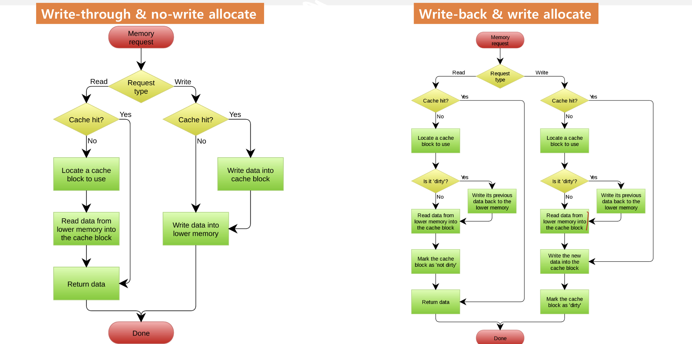

# Computer Architecture & Real-Time Operating System

## Contents for Computer Architecture
1. [Data Representation](#1-Data-Representation)
2. [Building and Loading Programs](#2-Building-and-Loading-Programs)
3. [Processor Architecture](#3-Processor-Architecture)
4. [Memory Subsystem](#4-Memory-Subsystem)
5. [I/O Devices](#5-I/O-Devices)
6. [Advanced Computer Architecture]

## Contents for Operating System(RTOS)
1. [Process Management]
2. [Process Scheduling]
3. [Virtual Meomory]
4. [Inter-Process Communication]
5. [Multithreading]
6. [Locking]
7. [Filesystem]
8. [Device Driver]
9. [Real-Time Scheduling]

## 1. Data Representation
Computer system에는 다양한 종류의 데이터가 존재한다.  

1.Bit: 컴퓨터에서 데이터의 가장 작은 유닛, 0과 1 두개 중에 하나를 가진다. 이를 통해서 2가지 표현이 가능  
2.Byte: 8개의 인접한 bit sequence(8bit), 2^8(256)개 의 다른 상태를 표현할 수 있다. Can store a single character, The unit of memory addressing  
3.Word: 2개의 인접한 bytes(16bit) 2^16개의 다른 상태 표현 가능, Another meaning of word: "the natural data size of a processor"  
4.DWord: 2개의 인접한 Word(32bit) 2^32개의 상태 표현 가능  

### Integer Representation
컴퓨터에서 Binary notation(2진법)이 비트를 사용하는 자연스러운 방법  
n개의 비트를 이용해서 2^n개의 mapping을 하여 숫자들을 표현할 수 있다.  

정수 데이터 타입 
 

 
 

#### Mapping for Unsigned Types
하나의 byte는 256개의 서로다른 상태를 나타낸다. 그렇다면 우리는 이 8개의 비트를 2진수로 해석할 수 있다.
#### Signed Types : Naïve methood
8개의 비트중 가장 앞의 비트를 이용해서 (0:양수, 1:음수)를 결정하고 뒤 7개 비트를 이용해서 표현한다.

  
문제점 : 0000과 1000이 모든 0을 의미함 (낭비)  

#### Signed Types : Two's Complement Method
MSB가 0이면 이것을 그대로 해석하고 MSB가 1이라면 0과 1을 바꾼뒤 +1을 해서 해석한다. (이를 통해 Naïve method 문제점 해결)

 
 

#### Byte Ordering
Little-Endian Ordering e.g.) Intel CPUs
Big-Endian Ordering e.g.) Most ARM CPUs

 
 

#### Integer Overflow and Underflow
Overflow : data type의 범위를 넘어서면 ex) $11111111_2$ -> +1 -> $00000000_2$     
Underflow : data type의 범위를 내려가면 ex) $00000000_2$ -> -1 -> $11111111_2$

#### Hex code
하나의 byte를 2개의 4-bit로 나눠 16진법으로 표현한다. ex) unsigned char u = $01011111_2$ -> unsigned char u = 0x5F

### Real Number Representation
아무리 작은 범위를 잡아도 그곳에는 무수히 많은 실수가 존재한다. 컴퓨터에서는 n개의 비트를 이용해 2^n개의 정확한 수를 나타낼 수 있다. 
#### Inaccuracy of "Floating-Point Numbers"
컴퓨터 시스템에서 실수를 근사화한 것을 Floating point number라고 한다. 
#### IEEE 754 Standard for Floating-Point Numbers
float:32bits, double: 64bits, 전부 다 signed data types이고 모든 컴파일러에서 같다. 

 
 

#### Floating Point Data Types

 
 

### Characters Representation
컴퓨터는 오직 숫자만 나타낼 수 있다, 그렇다면 글자는 어떻게 해야할까? 숫자와 글자의 1대1 대응을 통해서
#### 아스키코드 (ASCII Code)

 
 

#### String
character들과 마지막 Null character를 묶음.
#### 유니코드(Unicode)
ASCII코드에서 전세계 언어를 저장하기 위해서 유니코드로 확장되어짐. 1개의 바이트로는 유니코드를 저장할 수 없어서 멀티 바이트를 사용

### Multimidea Data
Multimedia Data : 이미지 해상도의 색상코드로 표현되는 픽셀 시퀀스   
Color Depth : 픽셀마다 할당된 bit 

 
 

## 2. Building and Loading Programs

### Compiler
프로그래밍 언어를 컴퓨터가 이해할 수 있는 언어로 변환해주는 컴퓨터 프로그램  
C compiler는 C code를 machine code로 변환해줌 ex) GNU C Compiler, Clang
 

 
 

### Three Steps of Build Process  

 

 
 
    

1. Preprocessing  
* Removing comments (주석제거)
* Including header files (헤더파일 포함)
* Expanding macros 
* Conditional compilation
* Line control  
Preprocessed C files은 compilation 이후에 없어지지만 -E option을 이용해 확인 할 수 있다.

2. Compiling
preprocessed C file을 object file로 변환해 준다.    
Object file은 CPU-dependent machine languague로 쓰여진다. 다른 CPU architecture끼리는 사용될 수 없고 instruction과 data를 포함하고 있다. 
Compiler optimization options. 
-fast code vs fast compilation vs small object vs ...
- -O option으로 가능하다.

3. Linking
object file(including CRT and libc) executable file로 묶는다. 
각각의 object file들은 서로다른 object file을 부르고 접근한다. 그러면 link가 만들어진다.  
Executable File은 여러 object file들로부터 링크된 Instruction과 data이다.  
실행되면, CRT에 entry function이 OS에 의해 불러진다.

### Program Loading   

 

 
 

파일에서 메모리로 텍스트와 데이터 세그멘트를 복사한다.  
* Text Area  
프로그램에 instruction을 저장한다.
* Data Area  
Initialized global variables을 저장한다.
* BSS Area  
Uninitialized global variables을 저장한다. 초깃값은 무조건 0이다. 
* Heap Area  
dynamic memory가 저장되고 크기가 변한다.
* Stack Area  
local variables을 저장한다. local variable은 function이 실행될때만 존재한다.  
재귀적으로 함수가 실행되어지면 stack의 크기가 점점 증가한다.  
이때 스택이 Heap영역까지 커지면 이를 stack overflow라고 한다.  
악의를 가진 해커가 buffer overflow 기술을 이용해 함수가 돌아가야할 위치를 overwrite 하는 것은 stack smashing 이라고 한다. 

 

 
 

## 3. Processor Architecture

#### Bus-based Computer Architecture
System Bus : Connects CPU,Memory and I/O Deviced.   

 

 
 

 
#### Inside a CPU
 
PC (Program Counter) : 다음 instruction의 주소를 나타낸다.  
ALU (Arithmetic Logic Unit): arithmetic and logic operation을 지휘한다.  
Registers : General-purpose register과 Special-purpose register가 존재.  

 
 

#### Program Execution
PC(프로그램 카운터)를 메모리 시작 instruction에 위치시킨다.  
CPU가 PC에 instruction을 읽고 실행시킨다.  
PC는 하드웨어에 의해 자동으로 다음을 지칭한다. 

#### Registers
CPU안에 있는 임시 저장장치이다. memory접근에 비해서 매우 빠르고 크기가 작다.   
PC(Program Counter) , SP(Stack Pointer)와 같은 특별한 기능을 가진 레지스터도 있다.  

#### Processor Architecture
- Instruction Set Architecture(ISA) 
CPU가 어떤 언어를 이해하는가 
 

 
 

- Microarchitecture
어떻게 CPU가 디자인 되는가  

#### Instruction Set Arichitecture(ISA)
하드웨어와 소프트웨어 사이의 인터페이스  (Instruction, Registers, Memory access mode, Endianness ....). 
ISA별로 다른 컴파일러가 필요. 같은 C코드지만 서로 다른 instruction을 가짐, 그렇기 때문에 Compiler developer는 ISA를 전부 이해해야함.  

 
 

#### Microarchitecture
Chip-level Design (Cache, Pipelining, Out-of-order execution)

 
 

 
 

 
#### Von Neumann vs Harvard
- Von Neumann Architecture  
Instruction과 Data를 위한 Memory가 하나만 존재한다(동시접근 X).     
CPU와 Memory 사이 병목현상이 발생할 수 있다.      

 
 

 
- Harvard Architecture.   
Instruction과 Data를 위한 Memory가 각각 존재한다(동시접근 O)      
CPU와 memory사이에 병목현상이 발생이 적다.   

 
 

#### Two Competing Paradigms when Designed ISAs
-CISC(Complex Instruction Set Architecture). 
-RISC(Reduced Instruction Set Architecture). 

 
 

CISC : Register-memory architecture.         
RISC : Load-store architecture.      

#### Simple CPU with Single Cycle Datapath

 
 

#### Five Stages of Datapath

 
 

 
- Instruction Fetch : PC에서 instruction을 읽음, PC+=4.     
- Instruction Decode : instruction을 이해하고 register를 읽음.   
- Execute : operation을 실행하고 arithmetic/logic operation을 실행.   
- Memory Access : Memory에서 Load하고 Store함.    
- Write Back : 적절한 register에 결과를 기록함.    

#### Pipelining

 
 

 
Pipelined Datapath

 

 
 

 
- Pipeline Hazards

1. 구조적인 Hazard
HW resource 충돌, Harvard architecture가 pipelining 관점에서는 더 좋다.  

 
 

2. 데이터 Hazard 
Data dependencies (RAW, WAR, WAW). 

 
 

3. 컨트롤 Hazard 
Control uncertainty(if or else), Conditional branch.  
Speculative execution (그냥 실행)  
아무것도 하지 않는 것보다는 일단 실행하고, 잘못 예측한 경우 pipeline을 flush하고 다시 시작한다.  
Branch Prediction. (History를 보고 결정)    
historical data를 보고 가능성이 높은 곳을 결정한다.

#### Out-Of-Order Execution
instruction의 실행 순서를 바꾼다. (depends한 것을 뒤로 미룸)  

#### Processor Performance Metrics
* Latency(execution Time) 
Time to finish a program, 프로그램의 관점
 

 
 

* Throughput(bandwidth)   
특정 시간에 처리되어진 프로그램의 개수, 시스템의 관점  
 

 
 

## 4. Memory Subsystem
 
 

 
 

#### RAM(Random Access Memory

 

 
 

 
전원이 꺼지면 정보를 가지고 있을 수 없다. Bytes의 배열으로 system bus를 통해서 byte-addressable하다.  
램(RAM)의 2가지 타입  
1. SRAM(Stactic RAM)  
DRAM보다 빠르고 비싸다. refresh가 필요하지 않고 파워를 적게 사용한다. 주로 on-chip cache나 scratchpad memory로 이용된다.  
2. DRAM(Dynamic RAM)  
SRAM보다 느리고 저렴하디. refresh가 필요하고 파워를 많이 사용한다. 주로 off-chip main memory로 이용된다.  

#### Non-Volatile Memory
- ROM(Read Only Memory)  
Content들이 생산될때 hardwired 되어있다.  
- PROM(Programmable ROM)  
딱 한번 프로그램 가능하다.  
- EPROM(Erasable PROM)  
UV light를 통해 내용 전체를 지울 수 있는 PROM. 
- EEPROM(Electrically Erasable PROM)   
byte-level read, write가 가능하다.  Write할때 엄청 오래 걸린다.  

- Flash Memory   
page단위 writable(~KB), block단위 Erasable(~MB) pageㄹ를 쓰기전에 Block이 전부 지워져야함. 사용할 수록 닳아서 없어짐.  
2가지 종류의 Flash Memory. 
 
 

 
 

#### System Bus & Address Space
Address Space는 CPU가 System bus를 통해서 보는 virtual space.  
Assuming n-bit address bus and m-bit data bus. 
n-bit의 CPU는 n-bit address bus, n-bit data bus, n-bit registers and ALUs. 
 
 

 
 

 
#### Memory Map
address space에 메모리 devices를 Mapping. 
I/O devices들 또한 CPU에 의해서 mapped 허용 
 
 

 
 

#### Timing between CPU
- Asynchronous RAM
CPU와 RAM이 독립적으로 실행됨.  
- Synchronous RAM
CPU와 RAM이 서로의 타이밍을 알고 실행됨.  

#### CPU-RAM Performance Gap
RAM latency는 심각한 병목현상을 격게된다. (Instruction Fetch, Load instruction, Store instruction)  
 
 

 
 

 
#### Locality of Memory Accesses  

 

 
 

 
프로그램의 메모리에 접근하는 패턴을 보면  
- Temporal Locality(접근했던 곳을 또 접근한다.) ex) for문  
- Spatial Locality(접근했던 곳의 근처를 접근한다.) ex) 배열의 item접근  

#### Cache
Cache는 마치 책상처럼, RAM을 모든 책을 가지고 있는 도서관 처럼 생각할 수 있다.  
 
 

 
 

 
#### Basic Cache Operations
CPU는 RAM에서 word(4byte)를 읽는다   
- 이것이 캐시에 있으면 Hit이고, 그것을 그냥 읽는다.  
- 이것이 캐시에 없으면 Miss이고, RAM에서 그것을 복사하고 캐시에서 읽는다.   

#### Cache Management Policies

 

 
 

 
#### Cache Size & Block size
 
 

 
 

 
-Cache Size  
Large cache size - higher hit ratio & more cost  
Smaller cache size - lower hit ratio & less cost

-Block size    
Too large - 쓸모없는 데이터도 같이 캐시에 저장  
Too small - spatial locality를 충족시키지 못함  

#### Basic Cache Organization
 
 

 
 

 
#### Cache Controller : Data Load to Cache

 

 
 

 
#### Cache Controller : Hit Check
 
 

 
 

#### Placement : Direct Mapped
각각의 블록들이 저장될 곳이 정해져 있다.  
 
 

 
 

#### Placement : Fully Associative
블록들이 어디든 저장되어질 수 있다. 

 

 
 

#### Placement : Set Associative 
Set index를 가지고 블록들이 저장됨

 

 
 

#### Replacement Policy
-Direct mapped cahce : 희생되는 블록이 placement polict에 따라 자동으로 결정된다. (갈 곳이 정해져 있기 때문에) 
- Fully or set associative cache: 희생되는 블록을 자유롭게 정할 수 있다. (optimal replacement)

#### optimal replacement algorithm
- Random: 아무거나  
- FIFO: First In First Out. 
- LRU: Least Recently Used. 
- LFU: Least Frequently Used. 
- LRFU: Least Recently/Frequently Used. 

#### Unified or Separated Cache 
-Unified architecture: Data and instructions 이 같은 cache에 저장됨.  
-Separated architecture : Data and instructions을 위한 cache가 따로 존재한다.  
Separated architecture의 장점 : pipelining에 용의하다.   
Separated architecture의 단점 : flexible하지 않고, 복잡하다.  

#### Write Policy
-Cache가 hit일때   
Write-through : cache와 memory를 동시에 업데이트한다.  
Write-back : cache만 업데이트하고 나중에 희생될때 memory에 write한다. (Cache와 Memory의 내용이 일치하지 않는 것을 dirty라고 한다.)   

-Cache가 Miss 일떄   
Write allocate: miss된 block에게 cache를 할당한다.   
No-write allocate: 바로 Ram에 write한다.  

Write-back and Write allocate방식을 함께 사용한다: 더 복잡하지만 높은 hit ratio를 기대할 수 있다.  
Write-through and No-wirte allocate를 함께 사용한다: 간단하지만 낮은 hit ratio가 예상된다.  

#### Write Strategies
 
 

 
 

#### Multi-level Caches and Memory Hierarchy

 

 
 

## 5. I/O Devices

#### System Bus and I/O Devices
I/O devices는 memory같은 CPU의 주변 장치   
Memory-mapped I/O는 device register들이 address space에 mapped된다.   
 
 

 
 

 
#### Internal Bus vs External Bus

 

 
 

 
#### Memory-Mapped I/O vs Port-Mapped I/O
Memory-Mapped I/O.  
-Device register들이 address space에 mapping 된어진다.  
-다양한 device register들이 같은 방식으로 접근이 가능하다.   

Port-Mapped I/O 
-Device registers들이 별도의 I/O Space에 존재한다.  
-I/O device를 읽고 쓰기 위한 특정한 instruction이 존재한다.  

#### Volatile Keyword 
device register를 접근하기 위해서는 항상 Volatile Keyword를 사용해야한다.  
Volatile Keywordsms 최적화 기술을 사용하지 않는다는 의미  

#### Polling vs Interrupt 
- Polling  
CPU가 항상 바쁘고 하드웨어의 보조가 필요 없다.  

- Interrupt   
CPU가 항상 바쁘지 않고, Interrupt service routine(or interrupt handler) function

#### Memcpy vs DMA(Direct memory access)
-Memcpy : device에서 CPU register로 Load하고 register에서 memory로 Store한다.   
-DMA : CPU가 DMA controller에서 DMA를 요청한다. DMA controller는 device에서 memory로 복사한다. DMA controller는 CPU에게 끝을 알린다.    

 
 

