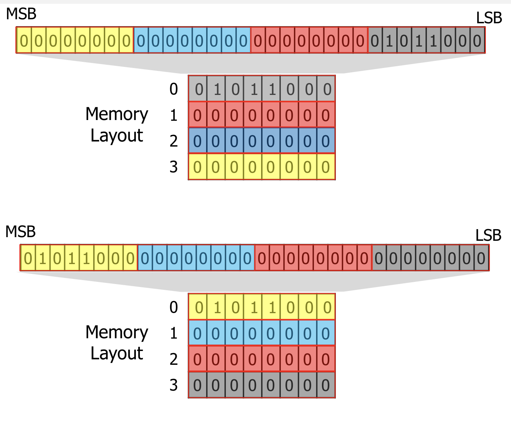

# Computer Architecture & Real-Time Operating System

## Contents for Computer Architecture
1. [Data Representation](#1-Data-Representation)
2. [Building and Loading Programs](#2-Building-and-Loading-Programs)
3. [Processor Architecture]
4. [Memory Subsystem]
5. [I/O Devices]
6. [Advanced Computer Architecture]

## Contents for Operating System(RTOS)
1. [Process Management]
2. [Process Scheduling]
3. [Virtual Meomory]
4. [Inter-Process Communication]
5. [Multithreading]
6. [Locking]
7. [Filesystem]
8. [Device Driver]
9. [Real-Time Scheduling]

## 1. Data Representation
Computer system에는 다양한 종류의 데이터가 존재한다.  

1.Bit: 컴퓨터에서 데이터의 가장 작은 유닛, 0과 1 두개 중에 하나를 가진다. 이를 통해서 2가지 표현이 가능  
2.Byte: 8개의 인접한 bit sequence(8bit), 2^8(256)개 의 다른 상태를 표현할 수 있다. Can store a single character, The unit of memory addressing  
3.Word: 2개의 인접한 bytes(16bit) 2^16개의 다른 상태 표현 가능, Another meaning of word: "the natural data size of a processor"  
4.DWord: 2개의 인접한 Word(32bit) 2^32개의 상태 표현 가능  

### Integer Representation
컴퓨터에서 Binary notation(2진법)이 비트를 사용하는 자연스러운 방법  
n개의 비트를 이용해서 2^n개의 mapping을 하여 숫자들을 표현할 수 있다.  

정수 데이터 타입 
 

 
 

#### Mapping for Unsigned Types
하나의 byte는 256개의 서로다른 상태를 나타낸다. 그렇다면 우리는 이 8개의 비트를 2진수로 해석할 수 있다.
#### Signed Types : Naïve methood
8개의 비트중 가장 앞의 비트를 이용해서 (0:양수, 1:음수)를 결정하고 뒤 7개 비트를 이용해서 표현한다.

  
문제점 : 0000과 1000이 모든 0을 의미함 (낭비)  

#### Signed Types : Two's Complement Method
MSB가 0이면 이것을 그대로 해석하고 MSB가 1이라면 0과 1을 바꾼뒤 +1을 해서 해석한다. (이를 통해 Naïve method 문제점 해결)

 
 

#### Byte Ordering
Little-Endian Ordering e.g.) Intel CPUs
Big-Endian Ordering e.g.) Most ARM CPUs

 
 

#### Integer Overflow and Underflow
Overflow : data type의 범위를 넘어서면 ex) $11111111_2$ -> +1 -> $00000000_2$     
Underflow : data type의 범위를 내려가면 ex) $00000000_2$ -> -1 -> $11111111_2$

#### Hex code
하나의 byte를 2개의 4-bit로 나눠 16진법으로 표현한다. ex) unsigned char u = $01011111_2$ -> unsigned char u = 0x5F

### Real Number Representation
아무리 작은 범위를 잡아도 그곳에는 무수히 많은 실수가 존재한다. 컴퓨터에서는 n개의 비트를 이용해 2^n개의 정확한 수를 나타낼 수 있다. 
#### Inaccuracy of "Floating-Point Numbers"
컴퓨터 시스템에서 실수를 근사화한 것을 Floating point number라고 한다. 
#### IEEE 754 Standard for Floating-Point Numbers
float:32bits, double: 64bits, 전부 다 signed data types이고 모든 컴파일러에서 같다. 

 
 

#### Floating Point Data Types

 
 

### Characters Representation
컴퓨터는 오직 숫자만 나타낼 수 있다, 그렇다면 글자는 어떻게 해야할까? 숫자와 글자의 1대1 대응을 통해서
#### 아스키코드 (ASCII Code)

 
 

#### String
character들과 마지막 Null character를 묶음.
#### 유니코드(Unicode)
ASCII코드에서 전세계 언어를 저장하기 위해서 유니코드로 확장되어짐. 1개의 바이트로는 유니코드를 저장할 수 없어서 멀티 바이트를 사용

### Multimidea Data
Multimedia Data : 이미지 해상도의 색상코드로 표현되는 픽셀 시퀀스   
Color Depth : 픽셀마다 할당된 bit 

 
 

## 2. Building and Loading Programs

### Compiler
프로그래밍 언어를 컴퓨터가 이해할 수 있는 언어로 변환해주는 컴퓨터 프로그램  
C compiler는 C code를 machine code로 변환해줌 ex) GNU C Compiler, Clang

 
 

### Three Steps of Build Process  

 
 

1. Preprocessing  
* Removing comments (주석제거)
* Including header files (헤더파일 포함)
* Expanding macros 
* Conditional compilation
* Line control  
Preprocessed C files은 compilation 이후에 없어지지만 -E option을 이용해 확인 할 수 있다.

2. Compiling
preprocessed C file을 object file로 변환해 준다.    
Object file은 CPU-dependent machine languague로 쓰여진다. 다른 CPU architecture끼리는 사용될 수 없고 instruction과 data를 포함하고 있다. 
Compiler optimization options. 
-fast code vs fast compilation vs small object vs ...
- -O option으로 가능하다.

3. Linking
object file(including CRT and libc) executable file로 묶는다. 
각각의 object file들은 서로다른 object file을 부르고 접근한다. 그러면 link가 만들어진다.  
Executable File은 여러 object file들로부터 링크된 Instruction과 data이다.  
실행되면, CRT에 entry function이 OS에 의해 불러진다.

### Program Loading   

 
 

파일에서 메모리로 텍스트와 데이터 세그멘트를 복사한다.  
* Text Area  
프로그램에 instruction을 저장한다.
* Data Area  
Initialized global variables을 저장한다.
* BSS Area  
Uninitialized global variables을 저장한다. 초깃값은 무조건 0이다. 
* Heap Area  
dynamic memory가 저장되고 크기가 변한다.
* Stack Area  
local variables을 저장한다. local variable은 function이 실행될때만 존재한다.  
재귀적으로 함수가 실행되어지면 stack의 크기가 점점 증가한다.  
이때 스택이 Heap영역까지 커지면 이를 stack overflow라고 한다.  
악의를 가진 해커가 buffer overflow 기술을 이용해 함수가 돌아가야할 위치를 overwrite 하는 것은 stack smashing 이라고 한다. 

 
 

